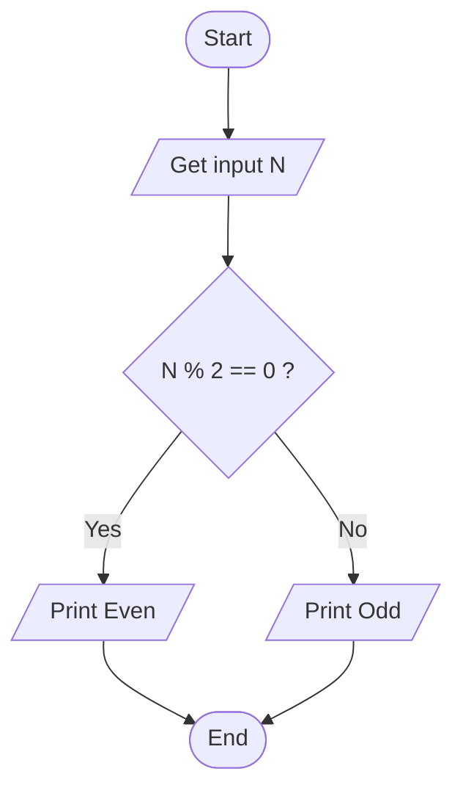
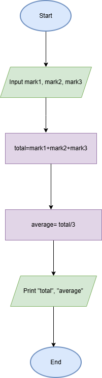
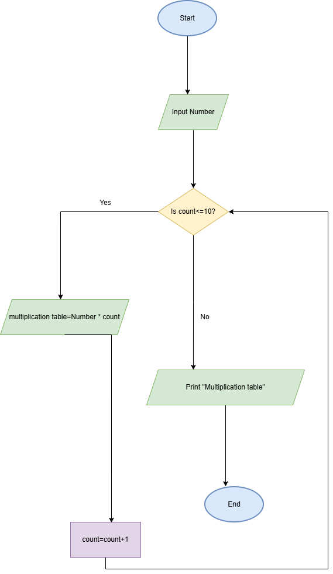
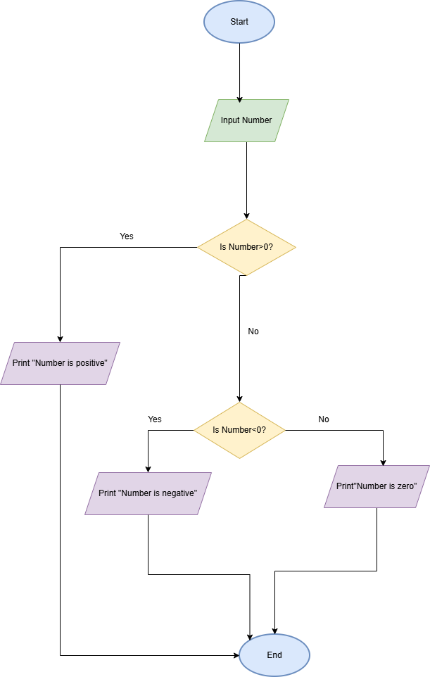
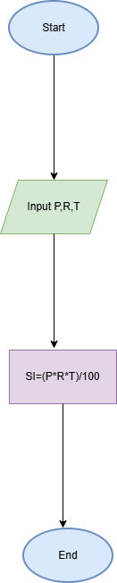
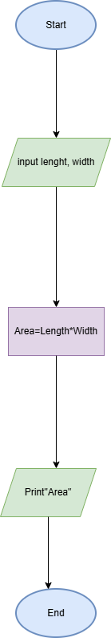
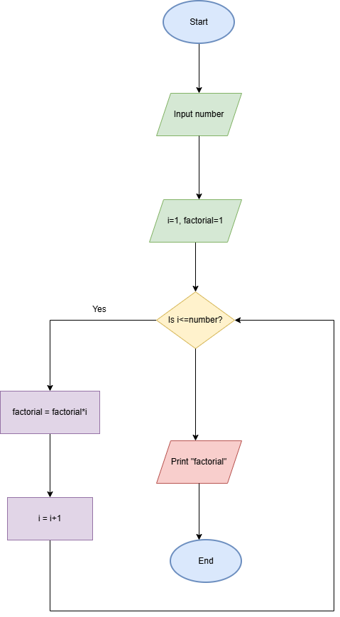

# Workshop: Algorithm and Flowchart

For each question in this workshop, you must complete **two** things:

1.  **Write the pseudocode**
2.  **Draw the flowchart** using either
    - **Option 1:** Draw.io (recommended) → export image → upload to
      your repository → link it in this file
    - **Option 2 (optional):** Write a Mermaid flowchart directly in
      Markdown
    - **Option 3 (optional):** Any other valid method

👉 **IMPORTANT:** At the **bottom of each question**, add the
following sections:

### ✔ Pseudocode

### ✔ Flowchart

---

## 1. Check Even or Odd Number

Design an algorithm and flowchart that take a number as input and
determine whether it is even or odd.

### ✔ Pseudocode

```text
START
    INPUT number
    IF number % 2 == 0 THEN
        PRINT Even
    ELSE
        PRINT Odd
    ENDIF
END
```

### ✔ Flowchart



---

## 2. Calculate Total and Average Marks

Write the algorithm and draw the flowchart for a program that inputs
marks for 3 subjects, calculates the total and average, and displays
both.

### ✔ Pseudocode

```text
START
    INPUT mark1
    INPUT mark2
    INPUT mark3
    total= mark1 + makr2 + makr3
    average = total / 3
    PRINT total
    PRINT average
END
```

### ✔ Flowchart


---

## 3. Display Multiplication Table

Create an algorithm and flowchart that input a number and display its
multiplication table from 1 to 10 using a loop.


### ✔ Pseudocode

```text
START
  INPUT NUMBER
  multiplication table = number * count
   IF count<=10 THEN
    REPEAT count = count + 1
    END REPEAT
   PRINT "multiplication table"

END
```

### ✔ Flowchart

---

## 4. Positive, Negative, or Zero Check

Write the algorithm and flowchart to input a number and display whether
it is positive, negative, or zero.

### ✔ Pseudocode

```text

START
    INPUT number
     IF number >0 THEN
      PRINT "POSITIVE"
       ELSE
        IF number<0 THEN
        PRINT "NEGATIVE"
        END IF
        ELSE
     PRINT "ZERO"
END

```

### ✔ Flowchart

---


## 5. Simple Interest Calculator

Create an algorithm and flowchart for a program that calculates simple
interest using the formula:

**SI = (P × R × T) / 100**

- **P = Principal** → original amount of money
- **R = Rate of Interest** → percentage per year
- **T = Time** → number of years

---
### ✔ Pseudocode

```text

START
    INPUT P
    INPUT R
    INPUT T
    SI = (P*R*T)/100
END

```

### ✔ Flowchart

---

## 6. Average Temperature Calculation

Write the algorithm and draw the flowchart for a program that takes the
temperature of 7 days, finds the average temperature, and displays it.

### ✔ Pseudocode

```text

START
    INPUT Temp1,Temp2,Temp3,Temp4,Temp5,Temp6,Temp7
    average temperature = (Temp1+Temp2+Temp3+Temp4+Temp5+Temp6+Temp7)/7
    PRINT "average temperature"
END
```
---
### ✔ Flowchart

---

## 7. Calculate Area of a Rectangle

Create an algorithm and flowchart to input length and width, calculate
the area (**Area = Length × Width**), and display the result.
### ✔ Pseudocode

```text

START
    INPUT length
    INPUT width
    area=length*width
    PRINT "area"
END
```
### ✔ Flowchart

---
---

## 8. Determine Pass or Fail

Write the algorithm and draw the flowchart for a program that takes a
student's average marks and displays **"Pass"** if average ≥ 50,
otherwise **"Fail"**.

### ✔ Pseudocode

```text

START
   INPUT average marks
   IF average marks >= 50 THEN
   PRINT "PASS" 
   ELSE
   PRINT "FAIL"
END
```
---
### ✔ Flowchart

---

## 9. Calculate Factorial of a Number

Write the algorithm and draw the flowchart that input a number and
calculate its factorial using a loop.

### ✔ Pseudocode

```text

START
   INPUT number
   i=1
   factorial=1
   REPEAT IF i<= number THEN
   factorial = factorial*i
   i=i+1
   END REPEAT
END
```
### ✔ Flowchart

---

## 10. Calculate Discount on Purchase

Write the algorithm and draw the flowchart for a program that inputs the
purchase amount and gives a **10% discount** if the amount is greater
than 1000.

## ✔ Pseudocode

```text

START
   
END
```
---
